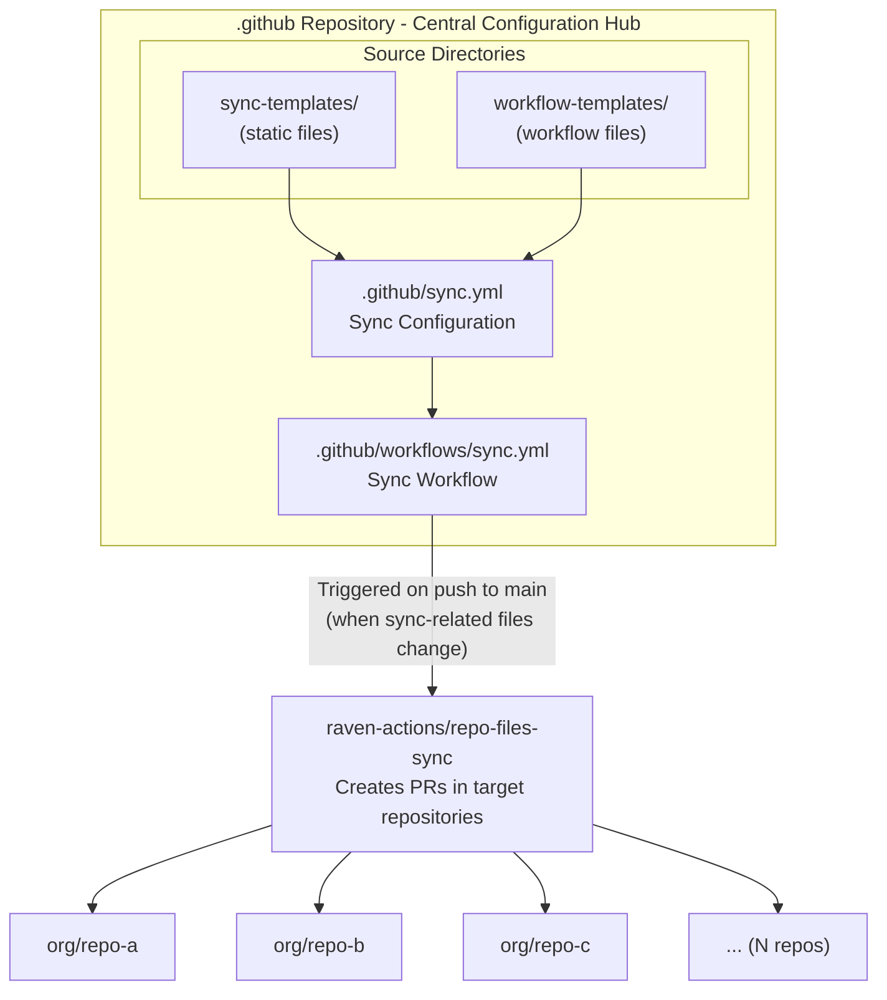
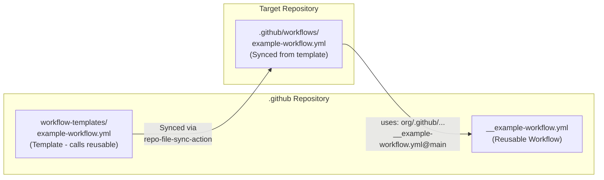

# Repository Files Sync

This document describes the centralized file synchronization used across the `radius-project` organization to maintain consistency and governance standards across all repositories.

## Table of Contents

- [Table of Contents](#table-of-contents)
- [Overview](#overview)
  - [Key Benefits](#key-benefits)
- [Architecture](#architecture)
- [Directory Structure](#directory-structure)
- [How Sync Works](#how-sync-works)
  - [Trigger Conditions](#trigger-conditions)
  - [Sync Process](#sync-process)
  - [Authentication](#authentication)
- [Configuration Files](#configuration-files)
  - [`.github/sync.yml` - Sync Configuration](#githubsyncyml---sync-configuration)
- [Sync Templates](#sync-templates)
- [Workflow Templates](#workflow-templates)
  - [1. GitHub Workflow Templates (UI)](#1-github-workflow-templates-ui)
  - [2. Synced Workflows](#2-synced-workflows)
  - [Example Templates](#example-templates)
- [Reusable Workflows](#reusable-workflows)
  - [Naming Convention: `__` Prefix](#naming-convention-__-prefix)
  - [Examples](#examples)
  - [Workflow Relationship Diagram](#workflow-relationship-diagram)
  - [Usage Pattern](#usage-pattern)
- [Adding New Files to Sync](#adding-new-files-to-sync)
  - [Step 1: Add the Source File](#step-1-add-the-source-file)
  - [Step 2: Update Sync Configuration](#step-2-update-sync-configuration)
  - [Step 3: Commit and Push](#step-3-commit-and-push)
- [Target Repositories](#target-repositories)
- [Troubleshooting](#troubleshooting)
  - [Sync Not Triggering](#sync-not-triggering)
  - [PRs Not Created](#prs-not-created)
  - [File Not Appearing in Target Repo](#file-not-appearing-in-target-repo)
  - [Merge Conflicts](#merge-conflicts)
- [References](#references)

---

## Overview

The `.github` repository serves as the **Single Source of Truth** (SSoT) for organization-wide configurations, templates, and policies. It uses an automated synchronization to distribute common files (such as licenses, linter configs, workflows, etc) to all repositories in the `radius-project` organization.

### Key Benefits

- 🔄 **Consistency**: Ensures all repositories follow the same standards
- 🛡️ **Governance**: Centralized control over critical files like LICENSE
- ⚡ **Automation**: Changes automatically propagate via Pull Requests
- 📝 **Audit Trail**: All changes are tracked through Git history and PRs

---

## Architecture



---

## Directory Structure

```text
.github/
├── .github/                             # GitHub-specific configurations for THIS repo
│   ├── sync.yml                         # ⚙️ SYNC CONFIGURATION FILE
│   └── workflows/
│       ├── sync.yml                     # ⚙️ SYNC WORKFLOW
│       └── __<workflow-name>.yml        # Reusable workflows (prefixed with __)
│
├── sync-templates/                      # 📁 Static files and nunjucks templates to sync
│   ├── <static-file>                    # Files synced as-is (no transformation)
│   └── <template-file>.njk              # Nunjucks templates (rendered before sync)
│
├── workflow-templates/                  # 📁 GitHub Actions workflow templates
│   ├── README.md                        # Documentation for workflow templates
│   ├── <template-name>.yml              # Workflow template file
│   └── <template-name>.properties.json  # Template metadata
│
└── eng/                                 # 📁 Engineering documentation
    └── SYNC.md                          # This file
```

---

## How Sync Works

### Trigger Conditions

The sync workflow (`.github/workflows/sync.yml`) is triggered when:

1. Code is pushed to the `main` branch
1. **AND** changes are made to any of these paths:
   - `.github/workflows/sync.yml` (the workflow itself)
   - `.github/sync.yml` (sync configuration)
   - `sync-templates/**` (any file in sync-templates)
   - `workflow-templates/*.yaml` or `workflow-templates/*.yml`

### Sync Process

1. **Checkout**: The workflow checks out the `.github` repository
1. **Authentication**: Obtains a GitHub App token with permissions for:
   - `metadata: read`
   - `contents: write`
   - `pull-requests: write`
   - `workflows: write`
1. **Bot Identity**: Retrieves bot details for commit attribution
1. **File Sync**: Uses [raven-actions/repo-files-sync](https://github.com/raven-actions/repo-files-sync) to:
   - Read the sync configuration from `.github/sync.yml`
   - Create branches (prefixed with `repo-sync`) in target repos
   - Copy files from source to destination paths
   - Open Pull Requests with commit messages prefixed with `chore:`

### Authentication

The sync uses a **GitHub App** for authentication (configured via secrets):

- `FILES_SYNC_BOT_APP_ID`: The GitHub App ID
- `FILES_SYNC_BOT_PRIVATE_KEY`: The GitHub App private key

This approach provides:

- Fine-grained permissions
- Better audit trails
- No dependency on personal access tokens

---

## Configuration Files

### `.github/sync.yml` - Sync Configuration

This is the heart of the sync. It defines:

- **Target repositories** (in the `repos` section)
- **File mappings** (source → destination)

```yaml
group:
  repos: |
    radius-project/.github
    radius-project/repo-a
    radius-project/repo-b@custom-branch   # Can specify different branches
    # ... more repos

  files:
    - source: sync-templates/LICENSE
      dest: LICENSE

    - source: sync-templates/.gitattributes
      dest: .gitattributes

    - source: workflow-templates/<template-name>.yml
      dest: .github/workflows/<template-name>.yml
```

**Key Features:**

- Uses [nunjucks templating](https://mozilla.github.io/nunjucks/templating.html) for advanced configurations
- Supports branch specification with `@branch` syntax
- Supports directory patterns and exclusions

---

## Sync Templates

The `sync-templates/` directory contains files that are synchronized **as-is** to target repositories. These are static files that should be identical across all repositories in the organization.

**Common use cases:**

- License files (e.g., `LICENSE`)
- Editor configuration files (e.g., `.editorconfig`)
- Git configuration files (e.g., `.gitattributes`)
- Code of conduct, contributing guidelines
- Any other file that should be standardized across repositories

Files placed in this directory are copied directly to the destination path specified in the sync configuration, without any transformation or templating.

---

## Workflow Templates

Files in `workflow-templates/` serve **two purposes**:

### 1. GitHub Workflow Templates (UI)

When developers create new workflows in any organization repository, they see these templates in the GitHub Actions UI. Each template requires:

- `<template-name>.yml` - The workflow file
- `<template-name>.properties.json` - Metadata (name, description, icon, categories)

**Example properties file:**

```json
{
  "name": "Example Workflow",
  "description": "Description of what this workflow does.",
  "iconName": "icon-name",
  "categories": ["category-1", "category-2"],
  "filePatterns": []
}
```

### 2. Synced Workflows

The same workflow files are synced to repositories via the sync, ensuring all repos have the workflow automatically.

### Example Templates

| Template                | Description                               |
|-------------------------|-------------------------------------------|
| `dependency-review.yml` | Scans PR dependencies for vulnerabilities |
| `lint.yml`              | Runs linting checks on code changes       |
| `ci.yml`                | Continuous integration workflow           |

---

## Reusable Workflows

### Naming Convention: `__` Prefix

Files in `.github/workflows/` that are intended to be **reusable workflows** (callable by other repositories) **MUST** be prefixed with double underscores (`__`).

**Why this convention?**

- 🔍 **Visual Distinction**: Easily identify which workflows are reusable vs. internal
- 📂 **Sorting**: `__` prefixed files appear at the top of directory listings
- 🔒 **Safety**: Prevents accidental modification of shared workflows
- 📖 **Documentation**: Self-documenting naming convention

**Naming pattern:** `__<workflow-name>.yml`

### Examples

| Workflow                  | Description                                   |
|---------------------------|-----------------------------------------------|
| `__dependency-review.yml` | Runs dependency scanning with standard config |
| `__lint.yml`              | Shared linting workflow                       |
| `__build.yml`             | Shared build workflow                         |

### Workflow Relationship Diagram



### Usage Pattern

Target repositories call reusable workflows instead of duplicating logic:

```yaml
# In target repository (synced from workflow-templates/)
jobs:
  example-job:
    uses: radius-project/.github/.github/workflows/__example-workflow.yml@main
    permissions:
      contents: read
      pull-requests: write
```

---

## Adding New Files to Sync

### Step 1: Add the Source File

Place the file in the appropriate directory:

- **Static files** (LICENSE, configs) → `sync-templates/`
- **Workflows** → `workflow-templates/`

### Step 2: Update Sync Configuration

Edit `.github/sync.yml` to add the new file mapping:

```yaml
files:
  # Existing files...

  - source: sync-templates/NEW_FILE
    dest: NEW_FILE
```

### Step 3: Commit and Push

Push to `main` branch. The sync workflow will automatically:

1. Detect the change
1. Create PRs in all target repositories

---

## Target Repositories

The sync targets repositories defined in `.github/sync.yml`. Example structure:

| Repository                    | Branch   | Notes                        |
|-------------------------------|----------|------------------------------|
| `radius-project/.github`      | main     | This repository (self-sync)  |
| `radius-project/main-project` | main     | Main project repository      |
| `radius-project/docs`         | **edge** | Custom branch example        |
| `radius-project/website`      | main     |                              |
| `radius-project/samples`      | **edge** | Custom branch example        |
| ...                           | ...      | Add all repositories to sync |

> **Note:** Use `@branch` syntax in `sync.yml` to specify non-default branches (e.g., `radius-project/docs@edge`).

---

## Troubleshooting

### Sync Not Triggering

1. Verify you pushed to `main` branch
1. Check that changed files match the path filters in `sync.yml`
1. Review Actions tab for workflow runs

### PRs Not Created

1. Check GitHub App permissions
1. Verify secrets `FILES_SYNC_BOT_APP_ID` and `FILES_SYNC_BOT_PRIVATE_KEY` are set
1. Review sync workflow logs for errors

### File Not Appearing in Target Repo

1. Verify file mapping in `.github/sync.yml`
1. Check if the file already exists (sync may skip or require manual merge)
1. Look for open PRs from the sync bot

### Merge Conflicts

The sync action creates PRs, not direct commits. If conflicts occur:

1. Review the PR in the target repository
1. Resolve conflicts manually
1. Merge the PR

---

## References

- [raven-actions/repo-files-sync](https://github.com/raven-actions/repo-files-sync) - The sync action used
- [Creating workflow templates](https://docs.github.com/en/actions/how-tos/reuse-automations/create-workflow-templates) - GitHub docs
- [Reusable workflows](https://docs.github.com/en/actions/using-workflows/reusing-workflows) - GitHub docs
- [GitHub Apps](https://docs.github.com/en/apps/creating-github-apps/about-creating-github-apps/about-creating-github-apps) - Authentication method
